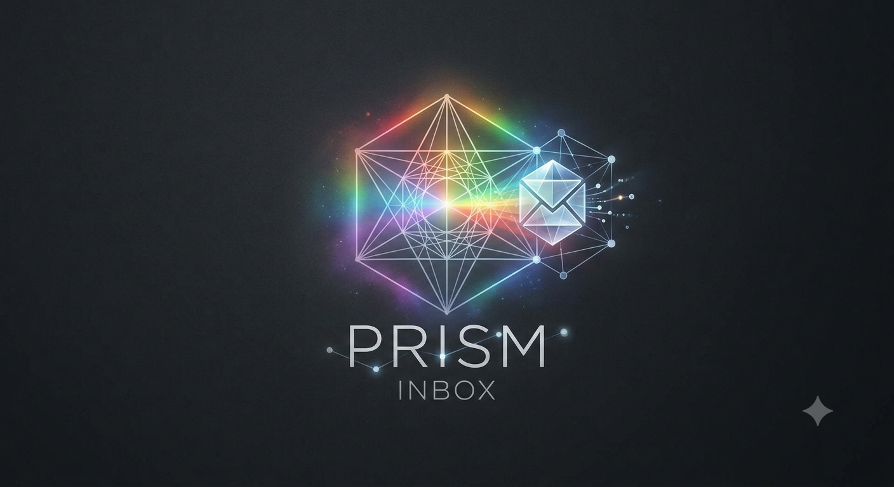

# Prism — Inbox Intelligence Agent

> An AI-powered email triage agent that separates your inbox by real stakes — not keywords.  
> Built for the Kaggle 5-Day AI Agents Capstone (Freestyle Track).



---

## What It Does

Most email tools sort by rules or keywords. Prism reasons about **real stakes** — reading each email, weighing signals, and explaining its judgment in plain English.

- **Triages** a batch of emails into four categories: Time-Sensitive, Actionable, Informational, Noise
- **Explains** every triage call with a plain-English reason — not just a label
- **Remembers** sender patterns across sessions (Prof. Reyes is usually FYI — so when he sends something with a real deadline, Prism flags it as unusual)
- **Suggests** a tone-matched reply automatically when you open an actionable email
- **Drafts** custom replies on demand — only after you provide intent, only after you approve
- **Never auto-sends** — every reply requires explicit human approval
- **Tracks tasks** in a built-in To Do list as you review emails

---

## Agent Concepts Demonstrated

| Concept | Implementation |
|---|---|
| **Tool / API Integration** | Gemini 2.5 Flash-Lite API for triage, drafting, and suggested replies |
| **Memory / Context Engineering** | SQLite sender pattern store — builds history across sessions, informs (never overrides) triage judgment |
| **Guardrails** | Never auto-sends, flags uncertainty instead of guessing, human confirmation before memory updates, RPD quota detection stops runaway API calls |
| **Agent Skill** | Multi-step pipeline: signal extraction → LLM triage → memory lookup → suggested reply → human review → simulated send |

---

## Architecture

```
Emails (JSON)
     │
     ▼
Signal Extraction (signals.py)
  ├── Near-term date detection
  ├── Thread position (first/follow-up/escalating)
  └── Sender history (from memory.db)
     │
     ▼
Gemini 2.5 Flash-Lite (triage.py)
  └── Structured prompt: signals + email content
  └── Returns: category + reasoning + confidence
     │
     ▼
Human Review (flask_app.py / Prism UI)
  ├── Browse by category
  ├── View full email + AI reasoning + sender memory
  ├── Auto-suggested reply (approve or reject)
  └── Custom draft on demand
     │
     ▼
Memory Update (memory_store.py)
  └── SQLite: confirmed results → sender patterns
  └── Human confirmation required before writing
```

---

## Stack

- **Python 3.11**
- **Gemini 2.5 Flash-Lite** (Google AI Studio, free tier / Tier 1)
- **SQLite** — persistent sender memory, no external database
- **Flask** — local web UI (Prism)
- **Gradio** — alternative UI
- No deployment, no real Gmail OAuth, no tracking pixels

---

## Setup

### 1. Clone the repo

```bash
git clone https://github.com/LokeshwariAnamalamudi/inbox---agent.git
cd inbox---agent
```

### 2. Create a virtual environment

```bash
python -m venv venv

# Mac/Linux
source venv/bin/activate

# Windows
.\venv\Scripts\Activate
# If PowerShell blocks activation:
Set-ExecutionPolicy -Scope Process -ExecutionPolicy RemoteSigned
```

### 3. Install dependencies

```bash
pip install -r requirements.txt
pip install flask gradio  # for the web UI
```

### 4. Add your Gemini API key

Get a free API key at [aistudio.google.com](https://aistudio.google.com).

Create a `.env` file in the project root:

```
GEMINI_API_KEY=your_key_here
```

### 5. Run triage on the sample inbox

```bash
# Windows
python -X utf8 -m src.triage --grouped --full

# Mac/Linux
python -m src.triage --grouped --full
```

This processes all 77 emails in the sample inbox. Takes 2-4 minutes with rate-limit-safe pacing.

### 6. Confirm results into sender memory

```bash
python -m src.confirm --all
```

### 7. Launch the Prism UI

```bash
# Windows
python -X utf8 flask_app.py

# Mac/Linux
python flask_app.py
```

Open [http://127.0.0.1:5000](http://127.0.0.1:5000) in your browser.

---

## Project Structure

```
inbox-agent/
├── src/
│   ├── triage.py          # Core triage pipeline (signals + Gemini)
│   ├── signals.py         # Deterministic signal extractors
│   ├── memory_store.py    # SQLite sender pattern memory
│   ├── confirm.py         # Human confirmation step before memory updates
│   ├── drafting.py        # Tone-matched reply drafting
│   ├── main.py            # Terminal agent interface
│   └── gemini_client.py   # Gemini API wrapper
├── data/
│   ├── sample_emails.json     # 77-email realistic dataset
│   └── sample_emails_dev.json # 19-email dev subset for fast iteration
├── static/
│   └── prism_logo.png
├── flask_app.py           # Prism web UI (Flask)
├── app.py                 # Alternative Gradio UI
├── docs/
│   └── WRITEUP_LOG.md     # Running build log (decisions, tradeoffs, failures)
├── .env                   # API key (not committed)
├── .gitignore
└── requirements.txt
```

---

## Key Design Decisions

**Batched API calls:** triage sends 10 emails per Gemini call (not 1), cutting request count ~7x to stay within free-tier rate limits. Each response is matched back by email ID, not position, so a malformed response degrades gracefully per-email rather than corrupting the batch.

**Memory informs, never overrides:** sender history feeds into the triage prompt as one signal among several. The model can and does override historical patterns when content warrants it — demonstrated by Prof. Reyes (9 FYI emails, 1 real deadline flagged correctly as time-sensitive despite the pattern).

**Guardrails at three levels:** prompt-level (don't guess at ambiguous intent), code-level (simulate_send has no real mail infrastructure — structurally impossible to send real email), architecture-level (memory only updates on explicit human confirmation, never automatically).

---

## Known Limitations

- **e015 misclassification:** "URGENT URGENT URGENT — Last chance pricing" was classified as time-sensitive despite being spam. The model discounts tone correctly but was fooled by a fabricated deadline claim. Sender memory partially addresses this over time; a domain trust signal would be the complete fix.
- **Occasional parse errors:** 2/77 emails were dropped from their batch response under server load. The safety net flags these for manual review rather than misfiling them.
- **No real Gmail integration:** triage runs on a JSON dataset, not a live inbox. Future scope: MCP server integration for live Gmail/calendar access.

---

## Future Scope

- MCP server integration for real Gmail and Google Calendar access
- Domain trust scoring to catch fabricated deadlines in marketing emails
- Automatic retry for parse-error emails using single-call fallback
- Scheduled triage runs on live inbox

---

## Author

Lokeshwari Anamalamudi  
Built for the Kaggle 5-Day AI Agents Intensive Capstone — Freestyle Track  
July 2026
